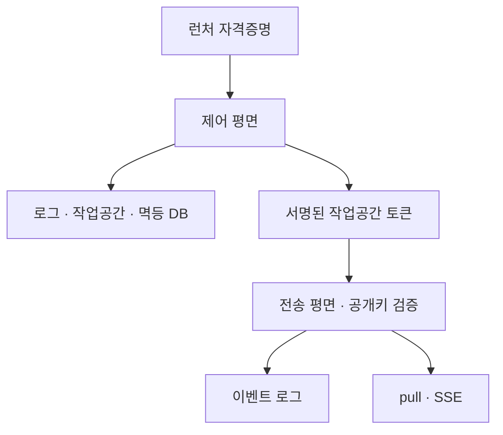

# mori-nest

[`mori`](https://github.com/shakystar/mori)를 위한 공유 기억 서버.
이벤트 전송 프로토콜과 로그·작업공간의 권한 및 생명주기를 다룬다.

## 프로젝트 상태

군 복무 중 개인 프로젝트로 개발했다. 모델 API 사용과 반복 평가에 드는 비용, 복무 중 확보할 수 있는 개발 시간, 관련 도구의 등장을 함께 고려해 추가 개발을 종료했다. 구현한 코드와 검증 기록을 보존하며, 신규 기능 개발과 정기 유지보수는 계획하지 않는다.

라이선스는 [MIT](LICENSE)다. [최종 구현·검증 상태](docs/final-status.md)와
[전체 프로젝트 사례](https://github.com/shakystar/mori/blob/main/docs/case-study.md)를 함께 참고한다.
기준 버전에는 전송 평면과 제어 평면의 HTTP 서버·라우트가 구현되어 있다.
과거 README의 ‘제어 평면 라우트 0건’ 설명은 초기 단계의 기록이다.

## 구조와 설계

| 영역      | 역할                                    | 주요 코드                                       |
| --------- | --------------------------------------- | ----------------------------------------------- |
| 전송 평면 | 토큰 검증, 이벤트 append/pull/subscribe | `src/transport/`                                |
| 제어 평면 | 로그·작업공간 생성·조회·폐기, 토큰 발급 | `src/control/`                                  |
| 공유 부분 | 요청 본문·오류 봉투·메서드 판정         | `src/body.ts`, `src/errors.ts`, `src/method.ts` |

- 전송 평면에는 Ed25519 **공개키**만, 제어 평면에는 **개인키**를 설정한다.
- 제어 평면의 자원 생성과 멱등 완료는 공유 DB 트랜잭션으로 묶는다.
- 이벤트 로그는 SQLite에 기록하며, 중복 이벤트·커서·출처 및 스키마 이주를 처리한다.
- subscribe는 SSE를 사용한다. 서버 구현을 mori의 자동 동기화·운영 서비스 완성으로 읽지 않는다.



## 구현된 HTTP 표면

| 평면 | 메서드·경로                                                                           | 동작                    |
| ---- | ------------------------------------------------------------------------------------- | ----------------------- |
| 전송 | `POST /v1/logs/{logId}/events`                                                        | append                  |
| 전송 | `GET /v1/logs/{logId}/events`                                                         | cursor 기반 pull        |
| 전송 | `GET /v1/logs/{logId}/subscribe`                                                      | SSE subscribe           |
| 제어 | `POST /v1/logs`                                                                       | 로그 생성               |
| 제어 | `GET /v1/logs`, `GET /v1/logs/{logId}`                                                | 로그 목록·단건 조회     |
| 제어 | `POST /v1/logs/{logId}/revoke`                                                        | 로그 폐기               |
| 제어 | `POST /v1/workspaces`                                                                 | 작업공간 개시·토큰 발급 |
| 제어 | `POST /v1/workspaces/{workspaceId}/heartbeat`                                         | 생명주기·토큰 갱신      |
| 제어 | `POST /v1/workspaces/{workspaceId}/close`, `POST /v1/workspaces/{workspaceId}/revoke` | 종료·폐기               |
| 제어 | `GET /v1/workspaces`, `GET /v1/workspaces/{workspaceId}`                              | 작업공간 목록·단건 조회 |

런처 자격증명 발급 HTTP API, 완성된 계정·멤버십 제품, PostgreSQL 이관은 포함하지 않는다.

## 빌드·검증

확인한 도구체인은 **Node 22.23.1 · pnpm 10.30.3**이다.
런타임 dependencies는 없으며 개발 의존성은 lockfile로 고정한다.

```bash
git clone https://github.com/shakystar/mori-nest.git
cd mori-nest
pnpm install --frozen-lockfile
pnpm typecheck
pnpm build
pnpm test
```

서버는 `createControlServer`와 `createTransportServer`로 조립하는 라이브러리다.
설정·키·DB를 주입하는 호출자가 필요하며 `pnpm start` 서비스는 제공하지 않는다.
API 키와 외부 모델 호출 없이 실제 로컬 HTTP·SQLite 동작을 확인하려면 기존 통합 테스트를 실행한다.

```bash
pnpm exec vitest run test/control-server.test.ts test/server.test.ts test/server-pull.test.ts test/server-subscribe.test.ts
```

이번 확인에서는 타입 검사·빌드와 테스트 214개가 통과했다.
실행 환경의 경고 처리 조건과 과거 CI 근거는 [최종 상태](docs/final-status.md#재현-결과)에 남겼다.

## 문서

- [요구사항](docs/design/0001-protocol-requirements.md)
- [전송 평면 스펙](docs/design/0002-transport-spec.md)
- [제어 평면 스펙](docs/design/0003-control-plane-spec.md)
- [전송 스토어 동시성 판정](docs/transport-unique-constraint-adjudication.md)
- [전신 기록 읽는 법](docs/inherited/_INHERITED.md)

`memorize_hub`는 전신 서버다. 이 저장소의 종료는 전신 서버의 운영 상태를 변경하지 않는다.
